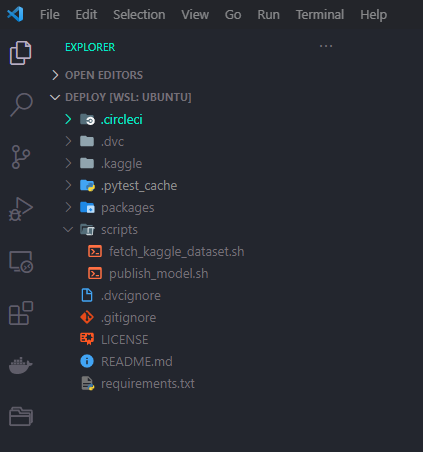
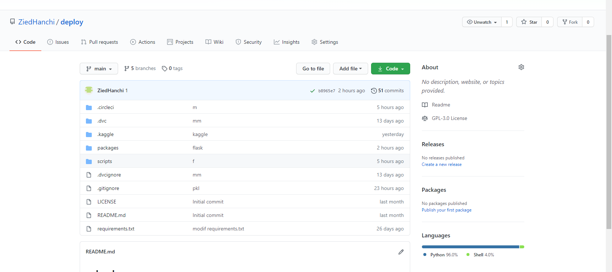
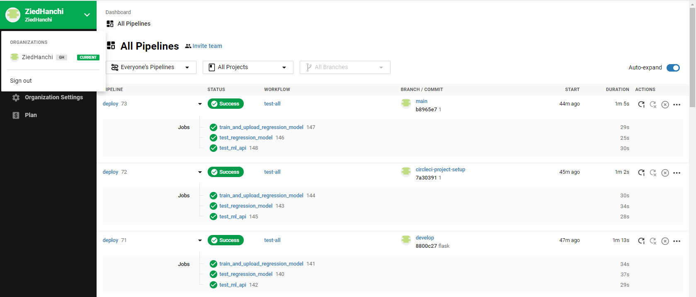
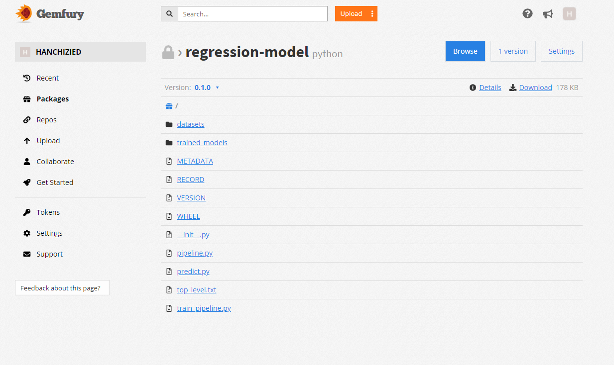

# Projet-1 : PRÉPARATION DE LA SOLUTION D'IA POUR LA MISE EN PRODUCTION

## Introduction :

Le TP qui suit consiste à création et le deployement d'une application d'intelligence artificielle en utilisant l'approche CI/CD.


Le code du projet a été developé en languages python, scripts linux et yaml et comprend les éléments suivants :
- codes sources pour l'entrainement d'un modèle de regression linéaire à l'aide de sklearn.linear_model.Lasso
- codes sources pour l'exposition du modèle sous format d'une API l'aide de FLASK
- codes sources pour la journalisation
- codes sources pour les tests unitaire / d'intégration
- codes sources pour la création de packages
- scripts pour importation des données à partir de [kaggle](https://www.kaggle.com/c/house-prices-advanced-regression-techniques) et le dépôt des packages sur [Gemfury](gemfury.com)
- script .yml pour définir le pipeline du projet exécuté sur [Circleci](https://circleci.com/)

Les outils et plateformes utilisés dans le cadre de ce projet sont :
- Système Ubunutu 20.04 WSL2 Linux (Windows Subsystem for Linux)
- Visual Studio Code
- git
- github
- kaggle (source de données)
- circleci (automatisation pipeline d'integration continue)
- gemfury (dépôt de packages)

#### Lien GitHub du projet :
[https://github.com/ZiedHanchi/deploy](https://github.com/ZiedHanchi/deploy.git)

#### Lien Cirleci :
[https://app.circleci.com/pipelines/github/ZiedHanchi](https://app.circleci.com/pipelines/github/ZiedHanchi?invite=true)

#### Liens GemFury :
[Lien full access avec token](https://4o7xpQzDMsdPxcx13xMM@pypi.fury.io/hanchizied/)
[Lien pour installer le package sous python](https://pypi.fury.io/hanchizied/
)

## Travail réalisé :
- Création d'un référentiel local git
- Création d'une branche develop sur laquel on réalise et on teste les ajouts et modifications de codes
- Création d'un référentiel distant sur github
- Création des fichiers de codes sur le référentiel local
- Modification et ajout séquentiel des fichiers de codes sur le référentiel local
- Tests en continues du code après chaque ajout/modification
- Merge du code vers la brache main
- Push du code vers le référentiel distant sur github
- Création et configuration d'un dépôt de packages sur Gemfury
- Partager le package sur le dépôt Gemfury
- Création et configuration d'une app sur circleci pour gérer le pipeline CI/CD du projet
- Modification/correction de portions de codes

## Modifications apportées au code :

**fetch_kaggle_dataset.sh**

```console
export PATH=$PATH:$(pwd)
 
cp -f .kaggle/kaggle.json ~/.kaggle

chmod 600 ~/.kaggle/kaggle.json

kaggle competitions download -c house-prices-advanced-regression-techniques -p packages/regression_model/regression_model/datasets/

unzip -o packages/regression_model/regression_model/datasets/house-prices-advanced-regression-techniques.zip -d "packages/regression_model/regression_model/datasets/"

rm packages/regression_model/regression_model/datasets/house-prices-advanced-regression-techniques.zip
```
**config.yml** 

Ajout des instructions : 
chmod +x ./scripts/fetch_kaggle_dataset.sh
./scripts/fetch_kaggle_dataset.sh
dans le bloc test_ml_api


```yaml
version: 2
jobs:
  test_regression_model:
    working_directory: ~/project
    docker:
      - image: circleci/python:3.7.2
    steps:
      - checkout
      - run:
          name: Runnning tests
          command: |
            virtualenv venv
            . venv/bin/activate
            pip install --upgrade pip
            pip install -r packages/regression_model/requirements.txt
            chmod +x ./scripts/fetch_kaggle_dataset.sh
            ./scripts/fetch_kaggle_dataset.sh
            py.test -vv packages/regression_model/tests

  test_ml_api:
    working_directory: ~/project
    docker:
      - image: circleci/python:3.7.2
    steps:
      - checkout
      - run:
          name: Runnning tests
          command: |
            virtualenv venv
            . venv/bin/activate
            pip install --upgrade pip
            pip install -r packages/ml_api/requirements.txt
            chmod +x ./scripts/fetch_kaggle_dataset.sh
            ./scripts/fetch_kaggle_dataset.sh
            py.test -vv packages/ml_api/tests

  train_and_upload_regression_model:
    working_directory: ~/project
    docker:
      - image: circleci/python:3.7.2
    steps:
      - checkout
      - run: 
          name: Setup env
          command: |
            virtualenv venv
            . venv/bin/activate
            pip install -r packages/regression_model/requirements.txt
      - run: 
          name: Publish model
          command: |
            . venv/bin/activate
            chmod +x ./scripts/fetch_kaggle_dataset.sh ./scripts/publish_model.sh
            ./scripts/fetch_kaggle_dataset.sh
            PYTHONPATH=./packages/regression_model python3 packages/regression_model/regression_model/train_pipeline.py
            ./scripts/publish_model.sh ./packages/regression_model/

workflows:
  version: 2
  test-all:
    jobs:
      - test_regression_model
      - test_ml_api
      - train_and_upload_regression_model
      - test_ml_api:
          requires:
            - train_and_upload_regression_model
```

**fichier.py**

Ajout d'un bloc d'ajout des emplacements des fichiers dans le sys.path
Si les emplacement des fichiers ne sont pas indiqués à l'interpréteur python il ne serait pas capable de les retrouver (en exécution locale)

```python
import os, sys
from pathlib import Path

if os.path.abspath(os.pardir) not in sys.path :
    sys.path.append(os.pardir)
if Path(os.path.dirname(os.path.realpath(__file__))).parent not in sys.path :
    sys.path.append(str(Path(os.path.dirname(os.path.realpath(__file__))).parent))   
if os.path.dirname(os.path.realpath(__file__)) not in sys.path :
    sys.path.append(os.path.dirname(os.path.realpath(__file__)))
```

**validation.py**

Enlever l'attribut strict=True non reconu par la classe HouseDataRequestSchema avec la version python utilisé.

```python
def validate_inputs(input_data):
    """Check prediction inputs against schema."""

    # set many=True to allow passing in a list
    schema = HouseDataRequestSchema(many=True)

    # convert syntax error field names (beginning with numbers)
    for dict in input_data:
        for key, value in SYNTAX_ERROR_FIELD_MAP.items():
            dict[value] = dict[key]
            del dict[key]

    errors = None
    try:
        schema.load(input_data)
    except ValidationError as exc:
        errors = exc.messages

    # convert syntax error field names back
    # this is a hack - never name your data
    # fields with numbers as the first letter.
    for dict in input_data:
        for key, value in SYNTAX_ERROR_FIELD_MAP.items():
            dict[key] = dict[value]
            del dict[value]

    if errors:/home/zied/deploy/deploy
        validated_input = _filter_error_rows(
            errors=errors,
            validated_input=input_data)
    else:
        validated_input = input_data

    return validated_input, errors
```

## Preuves de réalisation :

**Visual studio code :**


  
**GitHUB :**
  

  
**CircleCI :**


  
**Gemfury :**

